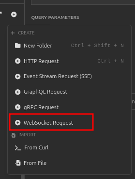
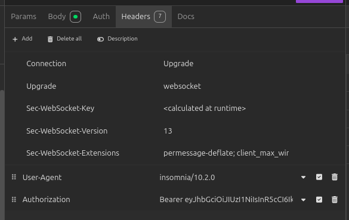

# Desafio YellotMob - Chat em tempo real

### Pré-requisitos
- Docker
- Docker Compose

## Como rodar o projeto:
1. Esteja em uma máquina com linux.
2. Clone o repositório, [documentação para clonar repositório](https://www.cloudbees.com/blog/git-pull-how-it-works-with-detailed-examples).
3. Renomeio o arquivo `.env.example` para `.env` e preencha as variaveis.
    - Você pode gerar uma secret key utilizando o a função `get_random_secret_key` do próprio Django.
4. Se você não tiver o `docker` e o `docker-compose` instalados, instale-os.
5. Abra o terminal na pasta do projeto e execute o comando `docker compose up --build websocket`.


## Funcionalidades:
- Autenticação de usuários
- CRUD de usuários
- CRUD de salas
- CRUD de mensagens
- Validação de formulários
- Comunicação em tempo real
- Caching de mensagens
- Testes automatizados
- Documentação de API


## Como realizar conexão com o websocket:
1. Abra o insominia ou postman.
2. Tenha um usuário cadastrado na aplicação.
3. Crie uma nova requisição do tipo `WebSocket Request`.
   - 
4. Preencha o campo `URL` com `ws://localhost:<Porta adicionada na variável DAPHNE_PORT>/ws/chat/<NomeDaSala>/`.
5. Adicione aos headers o campo `Authorization` com o valor `Bearer <token>`, certifique-se que o token está valido.
   - 
6. Clique em `Connect`.

## Payload para comunicar no websocket:
```json
{
    "message": "Hello World",
    "user": "username"
}
```

---

## Explicação das decisões de desenvolvimento

- **Django + Channels**: Optei por usar o Django com o Channels para gerenciar as conexões WebSocket. Isso permite integrar facilmente a comunicação em tempo real com as funcionalidades do Django.
- **PostgreSQL**: O PostgreSQL foi escolhido como banco de dados relacional devido à sua robustez e escalabilidade.
- **Redis**: Redis foi integrado para fornecer caching e suportar a comunicação em tempo real via Channels. Ele é essencial para gerenciar o estado e as mensagens em tempo real.
- **Docker**: Optei por usar o Docker para garantir que o ambiente de desenvolvimento seja reproduzível em diferentes máquinas. O Docker Compose facilita a configuração de múltiplos serviços (Django, PostgreSQL, Redis, WebSocket) e garante que todos funcionem juntos.

---

## Como rodar os testes

### Pré-requisitos

- Docker
- Docker Compose

### Passos para rodar os testes

1. Para rodar os testes automatizados, utilize o comando abaixo:
    ```bash
    docker-compose up --build test
    ```
---

